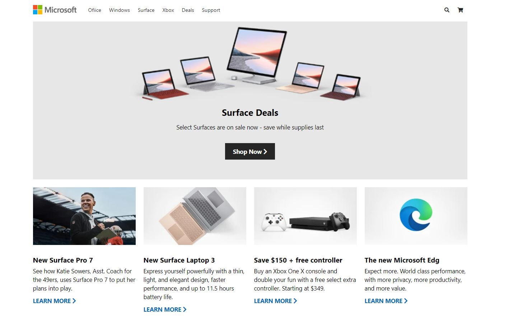
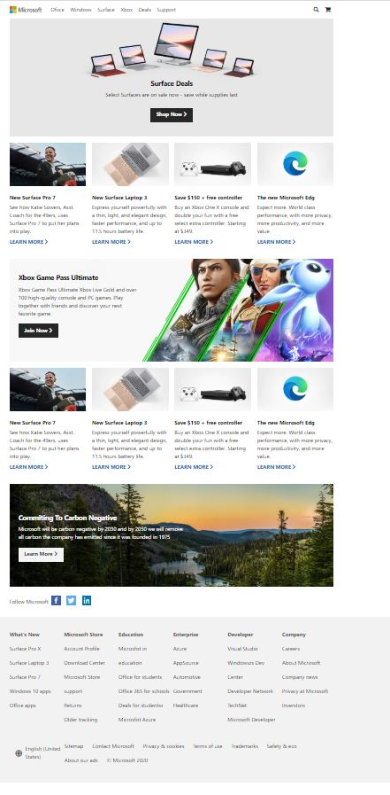

# Cloing-Micrsoft-Homepage

Cloning Micrsoft Homepage using HTML5, CSS, Flex and Media Queries



## Getting Started

These instructions will tell you how to clone the project. Then, I will tell you how to make it up and running in the developement environment.

### Prerequisites

- Git
- Visaul Studio Code (If you do not prefer this text editor, you can choose whatever you like)

### Installing

This step will show you how to clone this project into your computer.
First, open "Git Bash" in the directory that you want to save the project into
Then, Enter the below command in "Git Bash"

```
git@github.com:phithounsavanh/Cloning-Microsoft-Homepage.git
```

Next, open Visual Studio Code by entering the command in Git Bash

```
code .
```

### Summary

You will use Visual Studio Code to learn more about how the website is created and how html is structured. Also, you can use any browsers such Chrome and Firefox to open "index.html".
